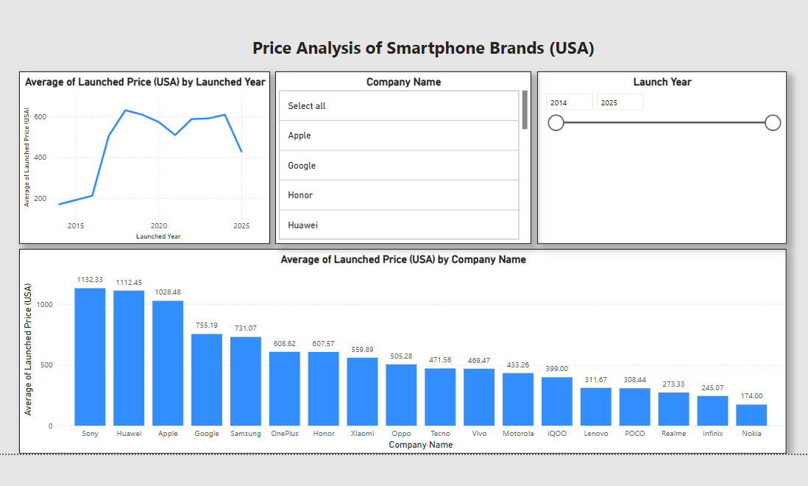
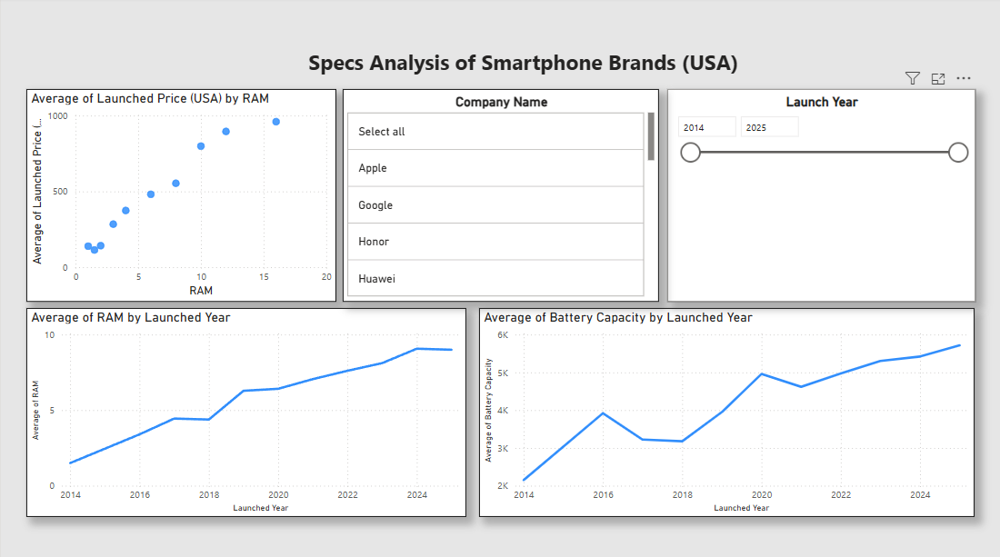

# 2025-Smartphone-Analysis

I. Overview

This PowerBI dashboard aims to analyze a comprehensive dataset containing information about smartphone companies, models, their prices, release years, and technical specifications. The dashboard provides insights regarding year over year trends in smartphone pricing within the United States, as well as hardware trends in relation to prices to hopefully provide meaningful information to both consumers and companies within the industry.

II. Dataset Discussion

The dataset used in this project was found on kaggle.com here: https://www.kaggle.com/datasets/abdulmalik1518/mobiles-dataset-2025, and was accessed in March of 2025.

The dataset includes specifications and official launch prices of various mobile phone models from different manufacturers, with the following key features:

- Company/Brand Name

- Model Name

- Device specifications (Weight, RAM, Front/Back Camera resolution, Processor, Battery capacity, Screen size)

- Official launch prices across five countries (Pakistan, India, China, USA, Dubai)

- Launch year

III. Data Cleaning and Preprocessing 

The data was cleaned and processed initially in Python, using Pandas and Matplotlib. Numerical columns in the initial CSV file were presented as strings, which were converted to their proper datatypes before
visualization in PowerBI. Additionally, vague and missing values were removed from the dataset, as well as severe outliers.

IV. PowerBI Dashboard 

This dashboard shows the general trends of smartphone pricing in the US. 

- Average Price Over Time Chart: The line graph in the top left depicts the average launch price of smartphones in the US, showing a trend of increasing average price since 2014. 

- Company Selection Filter: Interactive company filter which allows users to isolate and compare specific manufacturers' pricing strategies in the US.

- Time Range Slider:  Enables analysis across different launch years (2014-2025), helping identify market trends over time.

- Brand Comparison Bar Chart: The bar chart at the bottom compares average launch prices across all major smartphone manufacturers, highlighting Sony, Huawei, and Apple as premium-priced brands, while Nokia, Infinix, and Realme position themselves in the budget segment.

This dashboard demonstrates the relationship between smartphone specifications and pricing in the US market. This page features:

- Price-to-RAM Ratio Analysis: The scatter plot in the top-left corner visualizes how US launch prices correlate with RAM capacity, revealing the premium consumers pay for additional memory.

- Company Selection Filter: Interactive company filter which allows users to isolate and compare specific manufacturers' pricing and specification strategies.

- Time Range Slider: Enables analysis across different launch years (2014-2025), helping identify market trends over time.

- RAM Evolution Chart: The line graph on the bottom-left tracks the average RAM capacity in smartphones over time, showing the steady increase in memory specifications through time.

- Battery Capacity Trends: The bottom-right visualization shows how battery capacity has evolved over the years, indicating periods of significant improvement as well as plateaus.

V. Conclusion and Future Research

This analysis reveals useful insights into the smartphone market within the United States, where smartphone manufacturers can use the data regarding market positioning of competing brands to inform their own pricing strategies as well as identifying any potential gaps in the market. Furthermore, the RAM and battery capacity evolution charts help manufacturers benchmark their development roadmaps against industry trends, ultimately assisting brands in positioning their products competitively. Consumers can also benefit from the findings in this analysis, where identifying market segments can assist in consumers selecting brands that fit their budget. Additionally, the steady increase in both RAM and battery capacity over time creates a baseline for what consumers should expect at different price points in today's market, helping them identify whether a new smartphone purchase justifies its cost.

This project, of course, has room for improvement. The dataset is not entirely representative of the entire smartphone market, since it excludes smaller brands such as Asus and HTC. Furthermore, its data reaches back only to 2014, making long-term assessments of the market purely inferential. Other specifications about smartphones which could be useful for bolstering the analysis like screen resolution, storage capacity, and other features like fingerprint scanners and facial recognition would certainly provide a deeper, more comprehensive picture of the market today. Lastly, this analysis is purely focused on the smartphone industry within the United States, limiting the applicability of this analysis to those within the US market. Future research can add in these extra specifications to the analysis, as well as including additional markets, to provide a deeper analysis which can benefit a broader range of companies and consumers. 

